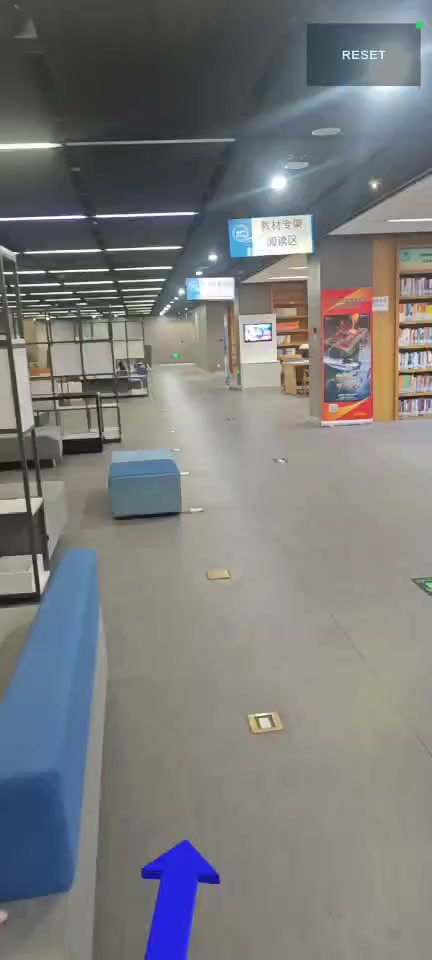

# StarTrack 
 
StarTrack（星轨）面向大型室内空间导航需求，利用现有WiFi基础设施与普通手机摄像头，实现低成本、可落地的AR室内导航。系统融合WiFi指纹粗定位、HLoc视觉精定位、自然语言目的地解析与语义拓扑寻路，支持用户以自然语言输入目的地，并在手机端获得实景AR箭头引导。相比依赖BLE/UWB等专用硬件的方案，本作品部署成本低、改造难度小，适用于智慧校园、图书馆、医院、商场等场景。

本仓库包含 StarTrack 室内 AR 导航系统的前端 Unity 工程源码、后端定位与导航服务源码、自然语言目的地解析代码，以及演示数据说明。

其中 `backend_server/` 对应本地项目工程中的 `backend/cloud_server/wifi_hloc` 主后端目录，包含当前版本的 WiFi 定位、HLoc 调用、自然语言目的地解析和拓扑导航代码。

## 项目成果与荣誉

- 获评国家级大学生创新创业训练计划项目，项目编号：`202503053`。
- 获得2026年中国高校计算机大赛-网络技术挑战赛华北赛区省级二等奖

[查看结题证书原始 PDF](./demo/面向自然语言交互的WiFi视觉融合AR室内导航系统.pdf)

## 应用下载与演示

- [下载 Android 演示应用（APK，50.59 MiB）](demo/StarTrack-Android-demo.apk)
- [观看实机 AR 导航演示（MP4，约 77 秒）](demo/StarTrack-navigation-demo.mp4)
- [查看演示文件说明与校验值](demo/README.md)

点击下图可打开完整演示视频：

<p align="center">
  <a href="demo/StarTrack-navigation-demo.mp4">
    
  </a>
</p>

演示从自然语言目的地输入开始，展示视觉定位、路径生成、AR 箭头引导以及到达目的地提示。APK 为项目验收阶段保留的 ARM64 Android 演示构建，完整在线定位依赖后端服务。

## 核心实验结果

以下结果采用项目书最终统计口径。视觉定位实际运行使用约 9,600 张室内参考图像；考虑到数据体积、室内场景隐私及公开授权问题，原始采集图像不随源码仓库发布。

| 模块 | 评估指标 | 结果 |
| --- | --- | ---: |
| WiFi 粗定位 | 平均定位误差 | 3.64 m |
| WiFi 粗定位 | 中位定位误差 | 2.90 m |
| WiFi 粗定位 | 误差不超过 3 m / 5 m | 57.1% / 71.4% |
| WiFi 粗定位 | 最大定位误差 | 8.50 m |
| HLoc 视觉定位 | 平均 / 中位平移误差 | 0.389 m / 0.367 m |
| HLoc 视觉定位 | 平移误差 RMSE | 0.440 m |
| HLoc 视觉定位 | `<1.00 m` 且 `<10°` 联合阈值准确率 | 94.88% |
| HLoc 视觉定位 | 820 张真值图像定位成功率 | 100.00% |
| 区域约束检索 | 候选图像规模 | 约 9,600 → 约 110 |
| 区域约束检索 | Top-10 召回率 | 82.5% → 96.7% |
| 区域约束检索 | 跨区域漂移率 | 8.3% → &lt;0.8% |

WiFi 指标对应项目书采用的代表性测试结果；HLoc 指标基于 820 张可与真值位姿匹配的图像。详细实验背景与结果见 [`docs/`](docs/) 中的项目书和结题报告。

阅读建议：

1. `ARCHITECTURE.md`: 先了解整体系统、前后端调用链和坐标关系。
2. `frontend_unity/README_frontend.md`: 查看 Unity 前端工程结构和主要脚本。
3. `backend_server/README_backend.md`: 查看后端接口、依赖和运行方式。
4. `demo_data/dataset_manifest.md`: 查看未直接放入源码包的大体积演示数据说明。
5. `demo/README.md`: 下载 Android 演示应用并查看实机导航视频。

## 目录结构

```text
StarTrack-ARIndoorNav/
  frontend_unity/     Unity Android/AR 前端工程
  backend_server/     Python 后端服务、WiFi 定位、HLoc 调用、语义目的地解析与拓扑导航代码
  demo/               Android 演示应用、实机导航视频与预览图
  demo_data/          演示数据说明，不直接内置大体积视觉地图数据
  docs/               可放置项目书、答辩 PPT、演示视频链接等材料
  ARCHITECTURE.md     系统结构、调用链、坐标关系说明
  README.md           项目总览、实验结果与成果展示
```

## 前端环境

- Unity: 2022.3.62f3c1
- 平台: Android
- 主要依赖: AR Foundation, ARCore, TextMeshPro, UGUI

打开方式：使用 Unity Hub 打开 `frontend_unity` 目录。

## 后端环境

- Python: 建议 3.10
- Web 框架: FastAPI + Uvicorn
- 定位与导航模块: WiFi 指纹 WKNN + HLoc 视觉定位 + 语义目的地解析 + 拓扑路径规划

后端入口文件：`backend_server/full_backend_pipeline.py`

## 数据说明

源码包中保留了轻量级运行配置和语义拓扑数据：

- `backend_server/topology.json`: 室内语义拓扑图，包含节点坐标、aliases、category、description、ref_image
- `backend_server/radiomap.json`: WiFi 指纹地图
- `backend_server/semantic_destination.py`: 自然语言目的地解析逻辑
- `backend_server/build_clip_embeddings.py`: CLIP 节点图像向量构建脚本
- `backend_server/semantic_clip_embeddings.npz`: 已构建的 CLIP 节点图像语义向量

HLoc 视觉定位所需的大体积数据没有直接放入源码包，包括参考图像库、COLMAP/HLoc 特征文件、匹配文件、三维模型和模型权重。这些文件属于演示运行数据或缓存结果，体积较大，故未作为源码直接提交。CLIP 语义向量文件体积较小，已随源码包提交。

## 开源范围说明

本仓库主要用于展示系统设计、核心算法实现、前后端协作方式与项目实验结果。以下内容不在公开仓库中提供：

- 约 9,600 张室内参考图像及原始采集视频；
- 包含真实无线接入点信息的原始 WiFi 扫描日志；
- HLoc/COLMAP 大体积中间产物和模型缓存；
- 当前未找回源码的 WiFi Logger 采集工具。

仓库保留可阅读的核心源码、已构建的 WiFi RadioMap、语义拓扑配置、轻量级演示数据说明以及项目实验材料。公开版本的重点是说明方法与工程实现，不承诺在缺少私有场景数据时复现原部署环境的全部定位精度。
